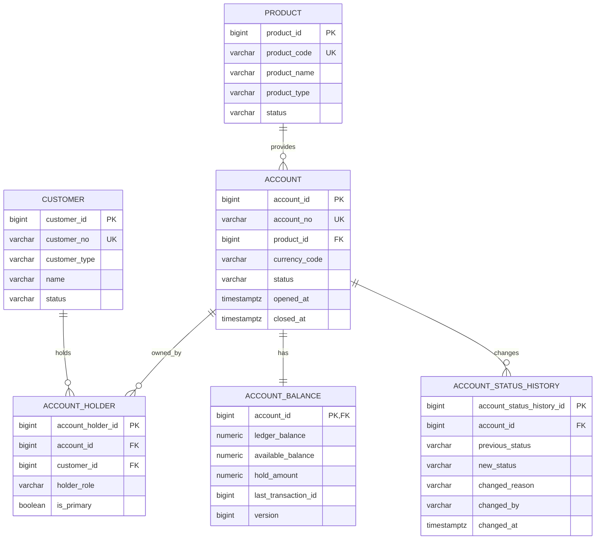
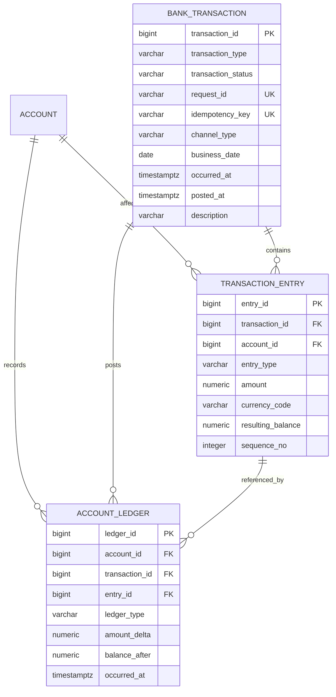
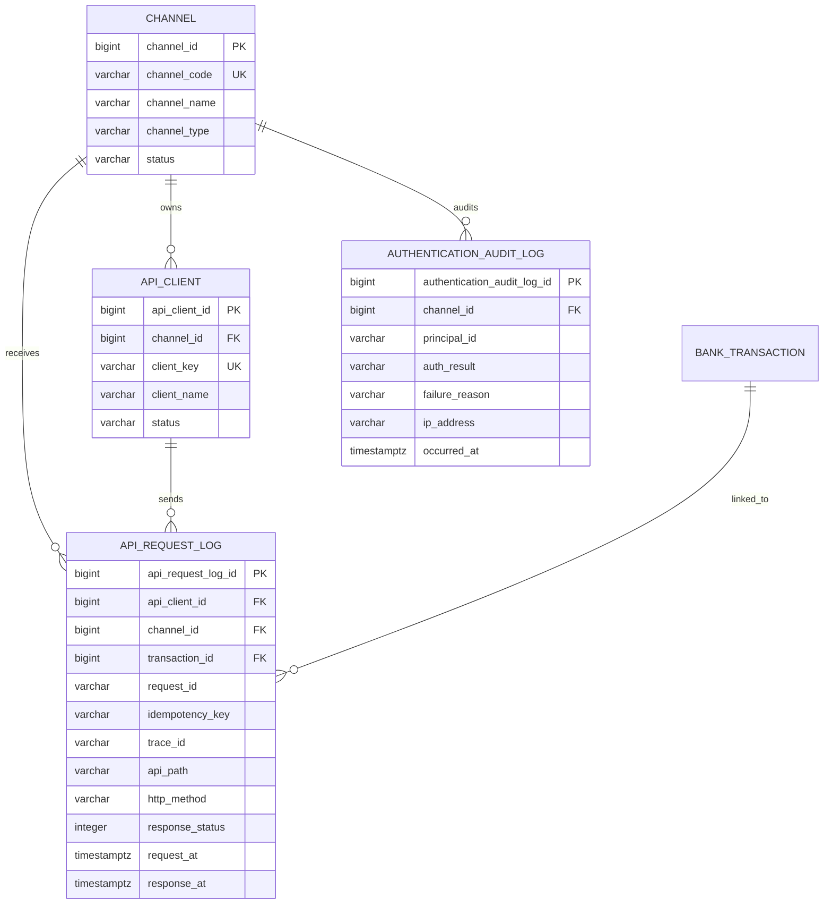
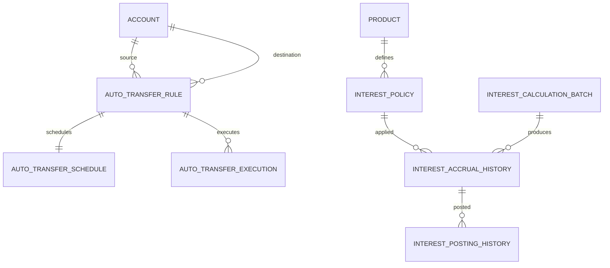
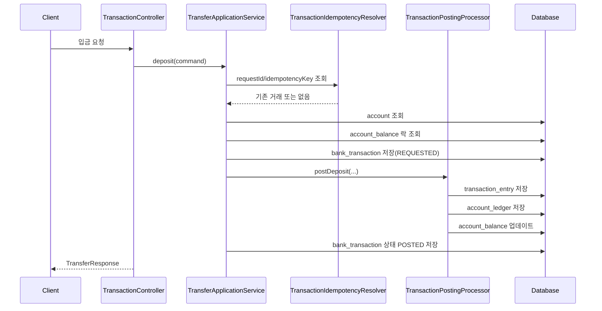

# 중간점검! 통합 ERD, 데이터 흐름, API 명세서

## 1. 문서의 목적

이 문서는 현재 프로젝트의 핵심 구조를 `한 번에` 이해할 수 있도록 만든 통합 설계 문서다.

이 문서에서 정리하는 범위는 아래와 같다.

1. 현재 프로젝트의 계층과 모듈 구조
2. ERD 관점의 데이터 구조
3. 데이터가 실제로 어떤 순서로 흐르는지
4. 현재 구현된 API 명세
5. DDL에는 준비되어 있지만 아직 애플리케이션 로직이 붙지 않은 영역

즉, 이 문서는 개별 설명 문서를 여러 개 읽기 전에 전체 지도를 먼저 잡고 싶을 때 보는 문서다.

## 2. 현재 프로젝트의 큰 구조

현재 프로젝트는 Spring Boot 멀티모듈 구조로 나뉘어 있다.

- `common`
- `account-domain`
- `transaction-domain`
- `transfer-domain`
- `interest-domain`
- `channel-api`
- `channel-security`
- `information-read`
- `batch`
- `bootstrap`

각 모듈의 역할은 아래와 같다.

| 모듈 | 역할 |
| --- | --- |
| `common` | 공통 예외, 공통 기반 엔티티, Money 값 객체 등 공통 요소 |
| `account-domain` | 고객, 상품, 계좌, 계좌 잔액, 계좌 소유 관계 |
| `transaction-domain` | 거래 헤더, 거래 엔트리, 계좌 원장 |
| `transfer-domain` | 입금, 출금, 이체 유스케이스와 거래 반영 |
| `interest-domain` | 이자 정책과 이자 계산 확장을 위한 자리 |
| `channel-api` | HTTP API, 요청/응답 DTO, 예외 응답, SDUI 화면 정의 API |
| `channel-security` | 채널 기준 데이터, API 클라이언트 식별, 학습용 보안 설정 |
| `information-read` | 운영 조회와 SDUI 대시보드용 읽기 모델 |
| `batch` | 배치 작업 확장을 위한 자리 |
| `bootstrap` | 실제 실행 모듈, 정적 리소스, 애플리케이션 설정 |

## 3. 구현 상태를 먼저 구분해서 보기

현재 프로젝트에는 `설계 완료`, `DDL 준비 완료`, `코드 구현 완료`가 섞여 있다.
그래서 이 문서를 읽을 때 아래처럼 구분해서 보는 것이 중요하다.

### 3.1 현재 코드까지 구현된 영역

- 고객, 상품, 계좌, 계좌 잔액 엔티티
- 거래 헤더, 거래 엔트리, 계좌 원장 엔티티
- 입금, 출금, 이체 서비스
- 멱등 처리
- API 요청 이력 저장
- 채널 기준 데이터, API 클라이언트 기준 데이터
- SDUI 운영 콘솔 API와 정적 렌더러

### 3.2 DDL로 준비되었지만 애플리케이션 로직은 아직 본격 구현되지 않은 영역

- 자동이체 규칙, 스케줄, 실행 이력
- 이자 정책, 이자 계산 배치, 이자 발생/반영 이력
- 인증 감사 로그
- 아웃박스 이벤트 발행

즉, DB 설계는 넓게 준비되어 있고, 애플리케이션 코드는 핵심 거래 영역부터 올라간 상태라고 이해하면 된다.

## 4. 데이터 분류 원칙

현재 스키마는 단순 기능별 분리보다 `데이터 성격별 분리` 원칙을 따른다.

### 4.1 기준 데이터

상대적으로 안정적이며 다른 데이터가 참조하는 데이터다.

예:

- `customer`
- `product`
- `channel`
- `api_client`
- `interest_policy`

### 4.2 상태 데이터

현재 상태를 빠르게 보여 주기 위한 데이터다.

예:

- `account_balance`
- `auto_transfer_schedule`

### 4.3 이력 데이터

시간 흐름에 따라 계속 누적되며 감사와 추적의 근거가 되는 데이터다.

예:

- `bank_transaction`
- `transaction_entry`
- `account_ledger`
- `api_request_log`
- `interest_accrual_history`
- `interest_posting_history`
- `auto_transfer_execution`

### 4.4 운영/통합 보조 데이터

직접 업무 데이터는 아니지만 시스템 운영과 연동을 위해 필요한 데이터다.

예:

- `authentication_audit_log`
- `outbox_event`

## 5. ERD 개요

전체 테이블을 한 번에 보면 너무 커지므로, 이해하기 쉽게 아래 세 묶음으로 나눠 본다.

1. 계좌/고객/상품 영역
2. 거래/원장 영역
3. 채널/운영/배치 확장 영역

## 6. ERD 1: 고객, 상품, 계좌, 잔액



### 6.1 핵심 해석

- `customer` 와 `account` 를 직접 1:1로 묶지 않고, `account_holder` 로 연결한다.
- 이 구조는 공동명의, 법인 계좌, 주계좌주/보조계좌주 구분 같은 확장에 유리하다.
- `account_balance` 는 계좌별 현재 잔액의 스냅샷이다.
- `account_status_history` 는 계좌 상태 변경 이력이다.

### 6.2 중요한 컬럼

#### `account.account_no`

- 외부에서 계좌를 식별하는 업무 키
- API 입력값으로 많이 사용됨

#### `account_balance.ledger_balance`

- 원장 기준 잔액

#### `account_balance.available_balance`

- 실제 출금 가능 잔액

#### `account_balance.hold_amount`

- 지급정지, 홀드, 보류 금액을 확장하기 위한 자리

#### `account_balance.version`

- 낙관적 락을 위한 버전 컬럼

## 7. ERD 2: 거래, 엔트리, 원장



### 7.1 왜 `bank_transaction`, `transaction_entry`, `account_ledger` 가 모두 필요한가

이 세 테이블은 비슷해 보여도 역할이 다르다.

#### `bank_transaction`

- 하나의 업무 거래 헤더
- 예: 한 번의 이체 요청, 한 번의 입금 요청

#### `transaction_entry`

- 거래가 각 계좌에 미친 영향의 줄 단위 표현
- 예: 이체는 보통 출금 1줄, 입금 1줄

#### `account_ledger`

- 계좌 중심의 원장 흐름
- 계좌 관점에서 시간순 조회가 쉽다

즉, 아래처럼 이해하면 된다.

- `bank_transaction`: 거래 1건
- `transaction_entry`: 거래의 회계성 줄
- `account_ledger`: 계좌별 원장 기록

### 7.2 현재 거래 타입

코드 기준 거래 타입은 아래가 중심이다.

- `DEPOSIT`
- `WITHDRAWAL`
- `TRANSFER`

### 7.3 현재 거래 상태

서비스 흐름상 아래 상태가 사용된다.

- `REQUESTED`
- `POSTED`

현재는 요청 생성 후 반영이 끝나면 `POSTED` 로 간다.

## 8. ERD 3: 채널, API 클라이언트, 요청 로그



### 8.1 핵심 해석

- `channel` 은 요청 진입 채널 기준 데이터다.
- `api_client` 는 채널 소속의 외부 호출 주체다.
- `api_request_log` 는 실제 요청 이력이다.
- `transaction_id` 가 연결되면 “이 요청이 어떤 거래를 만들었는가” 까지 추적할 수 있다.

## 9. ERD 4: 자동이체, 이자, 아웃박스

이 영역은 현재 DDL 준비가 되어 있으나 본격 애플리케이션 구현은 아직 시작 단계다.



### 9.1 의미

- 자동이체는 규칙, 스케줄, 실행 이력을 분리했다.
- 이자는 정책, 계산 배치, 발생 이력, 반영 이력을 분리했다.
- `outbox_event` 는 향후 비동기 이벤트 발행을 위한 통합 테이블이다.

## 10. 엔티티별 핵심 설명

아래는 현재 프로젝트에서 중요한 테이블을 빠르게 훑는 요약표다.

| 테이블 | 데이터 성격 | 역할 |
| --- | --- | --- |
| `customer` | 기준 데이터 | 고객 기본 정보 |
| `product` | 기준 데이터 | 상품 정의 |
| `account` | 기준 데이터 | 계좌 기본 정보 |
| `account_holder` | 기준 데이터 | 고객-계좌 관계 |
| `account_balance` | 상태 데이터 | 계좌 현재 잔액 |
| `bank_transaction` | 이력 데이터 | 거래 헤더 |
| `transaction_entry` | 이력 데이터 | 거래 엔트리 |
| `account_ledger` | 이력 데이터 | 계좌 원장 |
| `channel` | 기준 데이터 | 요청 채널 |
| `api_client` | 기준 데이터 | API 호출 주체 |
| `api_request_log` | 이력 데이터 | 요청 추적 로그 |
| `auto_transfer_rule` | 기준 데이터 | 자동이체 규칙 |
| `auto_transfer_execution` | 이력 데이터 | 자동이체 실행 이력 |
| `interest_policy` | 기준 데이터 | 이자 정책 |
| `interest_accrual_history` | 이력 데이터 | 이자 발생 이력 |
| `outbox_event` | 통합 보조 데이터 | 이벤트 발행 대기 |

## 11. 핵심 데이터 흐름 1: 입금

입금은 현재 구현된 핵심 흐름 중 가장 단순한 흐름이다.

### 11.1 처리 순서

1. 채널 API가 `POST /api/v1/transactions/accounts/{accountNo}/deposit` 요청을 받는다.
2. `X-Request-Id`, `Idempotency-Key` 를 읽는다.
3. 서비스 시작 시 멱등 여부를 먼저 확인한다.
4. 계좌를 조회한다.
5. 계좌 잔액을 락 조회한다.
6. 통화를 검증한다.
7. `bank_transaction` 레코드를 `REQUESTED` 상태로 저장한다.
8. `transaction_entry` 1건을 만든다.
9. `account_ledger` 1건을 만든다.
10. `account_balance` 를 증가시킨다.
11. 거래 상태를 `POSTED` 로 변경한다.
12. 응답을 반환한다.
13. 요청 종료 시 `api_request_log` 가 저장된다.

### 11.2 실제 영향 테이블

- `bank_transaction`
- `transaction_entry`
- `account_ledger`
- `account_balance`
- `api_request_log`

### 11.3 시퀀스 다이어그램



## 12. 핵심 데이터 흐름 2: 출금

출금은 입금 흐름과 비슷하지만 `잔액 검증` 이 추가된다.

### 12.1 추가 검증

- 요청 금액이 0보다 큰지
- 계좌 통화가 일치하는지
- `available_balance >= 출금 금액` 인지

### 12.2 영향 테이블

- `bank_transaction`
- `transaction_entry`
- `account_ledger`
- `account_balance`
- `api_request_log`

### 12.3 차이점

- 엔트리 타입은 `DEBIT`
- 원장 타입은 `WITHDRAWAL`
- `amount_delta` 는 음수

## 13. 핵심 데이터 흐름 3: 계좌이체

이체는 현재 구현 중 가장 중요한 흐름이다.

### 13.1 처리 순서

1. 멱등 여부 확인
2. 출금 계좌 조회
3. 입금 계좌 조회
4. 같은 계좌인지 확인
5. 두 계좌 잔액 락 조회
6. 출금 가능 잔액 확인
7. 거래 헤더 생성
8. 출금 엔트리 생성
9. 입금 엔트리 생성
10. 출금 원장 생성
11. 입금 원장 생성
12. 출금/입금 잔액 저장
13. 거래 상태 `POSTED`
14. 요청 로그 저장

### 13.2 실제 영향 테이블

- `bank_transaction` 1건
- `transaction_entry` 2건
- `account_ledger` 2건
- `account_balance` 2건 갱신
- `api_request_log` 1건

## 14. 멱등 처리 흐름

현재 거래 API는 모두 멱등 처리를 고려한다.

### 14.1 사용 키

- `requestId`
- `Idempotency-Key`

### 14.2 처리 규칙

- 같은 요청이면 기존 거래 결과를 재사용한다.
- 같은 키가 다른 거래를 가리키면 `IDEMPOTENCY_CONFLICT` 예외를 던진다.

### 14.3 왜 중요한가

금융 시스템에서는 재시도 때문에 같은 요청이 두 번 반영되면 안 되기 때문이다.

## 15. 채널 요청 추적 흐름

현재 채널계는 거래 반영만 하는 것이 아니라 요청 자체를 추적한다.

### 15.1 흐름

1. `TraceIdFilter` 가 요청마다 `traceId` 를 만든다.
2. 컨트롤러가 거래를 수행한다.
3. 성공 시 `transactionId` 를 요청 컨텍스트에 바인딩한다.
4. `ApiRequestLoggingInterceptor` 가 요청 종료 시점에 로그를 저장한다.
5. `channel-security` 의 `ChannelIdentityResolver` 가 채널과 API 클라이언트를 식별한다.

### 15.2 영향 테이블

- `api_request_log`

필요 시:

- `bank_transaction`

연결 정보:

- `channel_id`
- `api_client_id`
- `transaction_id`
- `request_id`
- `idempotency_key`
- `trace_id`

## 16. SDUI 운영 콘솔 데이터 흐름

현재 운영 콘솔은 별도의 프론트 프레임워크가 아니라 서버가 JSON으로 화면 구조를 설명하는 방식이다.

### 16.1 흐름

1. 브라우저가 `/sdui-admin/index.html` 을 연다.
2. `app.js` 가 `/api/v1/admin/screens/core-banking-overview` 를 호출한다.
3. `AdminScreenController` 가 SDUI 화면 정의 JSON을 반환한다.
4. 브라우저가 `component` 값을 보고 블록을 렌더링한다.
5. 10초마다 같은 화면 정의 JSON을 다시 요청한다.

### 16.2 현재 정보 원천

현재는 `information-read` 의 읽기 모델 서비스가 샘플 스냅샷 데이터를 만든다.
즉, 아직 실제 DB 연결보다는 구조 설명과 렌더링 학습이 중심이다.

## 17. 현재 구현 API 전체 목록

현재 코드 기준 공개된 주요 API/접속점은 아래와 같다.

### 17.1 거래 API

- `POST /api/v1/transactions/accounts/{accountNo}/deposit`
- `POST /api/v1/transactions/accounts/{accountNo}/withdraw`
- `POST /api/v1/transactions/transfer`

### 17.2 운영 화면 API

- `GET /api/v1/admin/screens/core-banking-overview`

### 17.3 정적 페이지

- `GET /sdui-admin/index.html`

### 17.4 개발용 콘솔

- `GET /h2-console`

## 18. 공통 요청/응답 규칙

### 18.1 공통 헤더

거래 API에서 중요하게 보는 헤더는 아래와 같다.

| 헤더 | 필수 여부 | 의미 |
| --- | --- | --- |
| `X-Request-Id` | 필수 | 요청 식별자 |
| `Idempotency-Key` | 선택 | 멱등 처리 키 |
| `X-Trace-Id` | 선택 입력 / 응답 포함 | 추적 식별자 |
| `X-Api-Client-Key` | 현재 선택 | API 클라이언트 식별 입력 |

### 18.2 성공 응답 구조

거래 API는 모두 `TransferResponse` 를 반환한다.

```json
{
  "transactionId": 123,
  "transactionType": "TRANSFER",
  "transactionStatus": "POSTED",
  "requestId": "REQ-001",
  "idempotencyKey": "IDEMP-001",
  "businessDate": "2026-04-03",
  "occurredAt": "2026-04-03T17:00:00+09:00",
  "postedAt": "2026-04-03T17:00:01+09:00",
  "description": "급여 이체",
  "traceId": "trace-abc"
}
```

### 18.3 오류 응답 구조

모든 API 오류는 `ApiErrorResponse` 형식으로 내려간다.

```json
{
  "code": "VALIDATION_ERROR",
  "message": "X-Request-Id 헤더는 필수입니다.",
  "path": "/api/v1/transactions/transfer",
  "timestamp": "2026-04-03T17:00:00+09:00",
  "traceId": "trace-abc"
}
```

## 19. 거래 API 명세: 입금

### 19.1 Endpoint

`POST /api/v1/transactions/accounts/{accountNo}/deposit`

### 19.2 Path Variable

| 이름 | 타입 | 설명 |
| --- | --- | --- |
| `accountNo` | String | 입금 대상 계좌번호 |

### 19.3 Headers

| 이름 | 필수 | 설명 |
| --- | --- | --- |
| `X-Request-Id` | 예 | 요청 식별자 |
| `Idempotency-Key` | 아니오 | 같은 요청 재시도 식별 |

### 19.4 Request Body

```json
{
  "amount": 10000.00,
  "currencyCode": "KRW",
  "description": "테스트 입금"
}
```

### 19.5 검증 규칙

- `amount` 는 null 이면 안 됨
- `amount >= 0.01`
- `currencyCode` 는 공백이면 안 됨

### 19.6 성공 시 영향 테이블

- `bank_transaction`
- `transaction_entry`
- `account_ledger`
- `account_balance`
- `api_request_log`

## 20. 거래 API 명세: 출금

### 20.1 Endpoint

`POST /api/v1/transactions/accounts/{accountNo}/withdraw`

### 20.2 Path Variable

| 이름 | 타입 | 설명 |
| --- | --- | --- |
| `accountNo` | String | 출금 대상 계좌번호 |

### 20.3 Request Body

```json
{
  "amount": 5000.00,
  "currencyCode": "KRW",
  "description": "테스트 출금"
}
```

### 20.4 추가 검증

- 계좌 존재 여부
- 계좌 잔액 존재 여부
- 통화 일치
- 출금 가능 잔액 충분 여부

## 21. 거래 API 명세: 이체

### 21.1 Endpoint

`POST /api/v1/transactions/transfer`

### 21.2 Request Body

```json
{
  "sourceAccountNo": "110-234-000001",
  "destinationAccountNo": "110-234-000002",
  "amount": 25000.00,
  "currencyCode": "KRW",
  "description": "테스트 이체"
}
```

### 21.3 검증 규칙

- 출금 계좌번호 필수
- 입금 계좌번호 필수
- 금액 필수
- 금액 0.01 이상
- 통화코드 필수
- 출금/입금 계좌가 서로 달라야 함
- 두 계좌 모두 존재해야 함
- 두 계좌의 통화가 요청 통화와 일치해야 함
- 출금 계좌 잔액이 충분해야 함

## 22. 운영 화면 API 명세

### 22.1 Endpoint

`GET /api/v1/admin/screens/core-banking-overview`

### 22.2 역할

이 API는 일반 데이터 API가 아니라 `화면 구조 정의 API` 다.

즉, 아래를 내려준다.

- 화면 제목
- 부제목
- 자동 새로고침 간격
- 블록 목록
- 각 블록의 컴포넌트 타입
- 각 블록의 너비(`span`)
- 블록별 데이터

### 22.3 대표 응답 속성

| 필드 | 의미 |
| --- | --- |
| `screenId` | 화면 식별자 |
| `title` | 화면 제목 |
| `subtitle` | 화면 부제목 |
| `generatedAt` | 화면 스냅샷 생성 시각 |
| `refresh.intervalSeconds` | 자동 새로고침 간격 |
| `blocks` | 블록 정의 목록 |

### 22.4 현재 사용 컴포넌트

- `metric-grid`
- `status-grid`
- `table`
- `log-list`
- `timeline`
- `fact-list`
- `action-list`

## 23. 오류 코드 명세

현재 공통 오류 코드는 아래와 같다.

| 코드 | HTTP 상태 | 의미 |
| --- | --- | --- |
| `ACCOUNT_NOT_FOUND` | 404 | 계좌를 찾을 수 없음 |
| `ACCOUNT_BALANCE_NOT_FOUND` | 404 | 계좌 잔액 정보를 찾을 수 없음 |
| `INVALID_AMOUNT` | 400 | 금액이 0보다 크지 않음 |
| `CURRENCY_MISMATCH` | 400 | 계좌 통화와 요청 통화 불일치 |
| `INSUFFICIENT_BALANCE` | 409 | 출금 가능 잔액 부족 |
| `SAME_ACCOUNT_TRANSFER` | 400 | 출금/입금 계좌 동일 |
| `IDEMPOTENCY_CONFLICT` | 409 | 요청 식별자 또는 멱등 키 충돌 |
| `VALIDATION_ERROR` | 400 | 요청값 검증 실패 |
| `INTERNAL_SERVER_ERROR` | 500 | 서버 내부 오류 |

## 24. 인덱스 설계에서 봐야 할 포인트

현재 DDL에는 운영상 중요한 인덱스가 들어가 있다.

### 24.1 거래/원장 조회

- `ix_bank_transaction_occurred_at`
- `ix_bank_transaction_business_date`
- `ix_transaction_entry_account_created_at`
- `ix_account_ledger_account_occurred_at`

의미:

- 기간별 거래 조회
- 계좌별 최근 거래 조회
- 계좌 원장 시간순 조회 최적화

### 24.2 API 추적 조회

- `ix_api_request_log_request_id`
- `ix_api_request_log_trace_id`
- `ix_api_request_log_transaction_id`

의미:

- 요청 ID 추적
- Trace ID 기준 추적
- 특정 거래와 연결된 요청 조회

### 24.3 배치/이자/자동이체 조회

- `ix_auto_transfer_schedule_next_execution_at`
- `ix_auto_transfer_execution_rule_planned_at`
- `ix_interest_accrual_history_account_end_date`
- `ix_outbox_event_publish_status_occurred_at`

## 25. 현재 아키텍처에서 중요한 설계 포인트

### 25.1 잔액은 직접 진실 원천이 아니다

`account_balance` 는 현재 상태를 빠르게 보여 주는 테이블이다.
궁극적인 근거는 `transaction_entry` 와 `account_ledger` 다.

### 25.2 요청 로그는 거래와 분리된 채널계 관심사다

요청 로그는 돈의 흐름이 아니라 요청의 흐름을 추적하는 정보다.
그래서 채널계에서 관리한다.

### 25.3 SDUI는 데이터 API와 다르다

운영 화면 API는 “데이터 전달”보다 “화면 설명” 에 더 가깝다.
즉, 서버가 어느 정도 화면 구성 책임을 가진다.

## 26. 이 문서를 읽은 뒤 추천 다음 문서

이 문서로 전체 그림을 잡은 뒤에는 아래 순서가 좋다.

1. `02-핵심-테이블-DDL-초안.md`
2. `07-JPA-구현체와-거래-반영-처리기-설명.md`
3. `11-API-요청-이력-저장-설명.md`
4. `14-SDUI-운영-콘솔-고도화-설명.md`

즉:

- 더 깊게 DB를 보고 싶으면 `02`
- 거래 반영 구현을 보고 싶으면 `07`
- 요청 추적을 보고 싶으면 `11`
- 운영 콘솔을 보고 싶으면 `14`

## 27. 문서 결론

현재 프로젝트는 `계좌-거래-원장` 을 중심으로 한 코어 뱅킹 핵심 흐름 위에, `채널 추적`, `멱등 처리`, `운영 SDUI 콘솔` 을 차례대로 쌓아 올린 상태다.

즉, 현재 시점의 구조를 한 줄로 요약하면 아래와 같다.

- 돈의 흐름은 `bank_transaction -> transaction_entry -> account_ledger -> account_balance`
- 요청의 흐름은 `channel/api_client -> api_request_log -> transaction`
- 운영의 흐름은 `information-read -> SDUI screen JSON -> browser renderer`

이 세 축을 같이 이해하면 현재 프로젝트를 가장 안정적으로 따라갈 수 있다.
